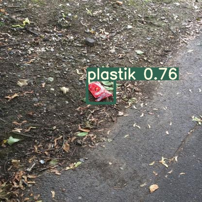
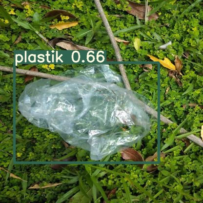

# Trash-Filter-YOLOV5

- In this project, I aim to raise people's awareness and encourage them to recycle so that the oceans, seas, or the environment do not become more polluted and damaged in our increasingly polluted world. This project is aimed to detect recyclable objects such as cardboard, paper, plastic, and metal with the help of artificial intelligence and to facilitate recycling.        
  
Technologies

- Image labeling program: LabelImg (Special thanks to @orcunmanap for labeling images).
- Object detection algorithm: YOLO Version 5.
- Model Format: Pytorch
- Data set: TACO
- To increase data: Roboflow

Screenshots:

 

